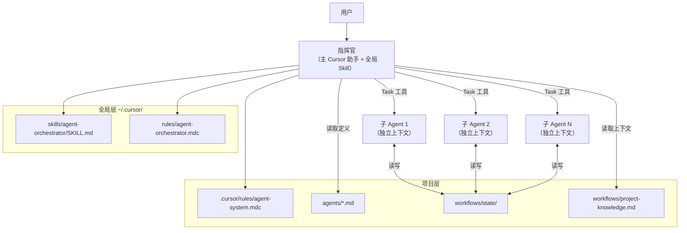

# AgentGOD 系统设计文档

## 1. System Overview

**System Name:** AgentGOD — 层级式多 Agent 编排系统

**Purpose:** 在 Cursor IDE 中提供一个可跨项目复用的层级式多 Agent 系统，用户只需与指挥官对话，系统自动分解任务、委派专家 Agent 执行、管理上下文切换，并支持中途接管已有项目。

**Automation Level Target:** L4 — Autonomous with Gates（关键操作需用户确认，常规任务自主完成）

**Key Stakeholders:** 使用 Cursor IDE 的开发者

---

## 2. Requirements

### Functional Requirements

| ID | Requirement | Priority |
|---|---|---|
| FR-01 | 用户只需与指挥官对话，指挥官自动分解和委派任务 | High |
| FR-02 | 支持自定义 Agent（通过 agents/*.md 文件定义身份和职责）| High |
| FR-03 | 上下文过长时自动检查点保存和上下文切换 | High |
| FR-04 | 跨项目复用：全局层安装一次，项目层按需部署 | High |
| FR-05 | 中途接管已有项目：自动扫描生成项目知识文件 | High |
| FR-06 | 子 Agent 可通过指挥官向用户提问获取信息 | Medium |
| FR-07 | 并行执行无依赖的子任务（最多 4 个） | Medium |
| FR-08 | 增量更新项目知识文件 | Medium |

### Non-Functional Requirements

| Dimension | Requirement |
|---|---|
| Latency | 子任务委派 < 5 秒启动 |
| Reliability | 失败时优雅降级，不丢失已完成的工作 |
| Cost | 简单任务不委派（减少 Token 消耗），使用 fast model 降低成本 |
| Security | 运行时状态不提交到 Git，API 密钥仅通过环境变量 |

### Human-in-the-Loop Gates

| Gate | Trigger Condition | Approval Mechanism |
|---|---|---|
| 子 Agent 提问 | Agent 返回 NEEDS_INPUT | 指挥官转达，用户在对话中回答 |
| 项目接管 | 首次扫描已有代码库 | 用户确认或 --takeover 标记 |
| 大规模变更 | 影响 >10 个文件 | 指挥官列出计划，用户确认后执行 |

---

## 3. Architecture

### Selected Pattern

**Primary pattern:** Hierarchical (Supervisor)

**Justification:** 用户需求明确是"一个领导指挥多个专家"，有清晰的命令链和职责分工。Hierarchical 模式提供集中控制、清晰的状态管理和简单的通信路径。

**Secondary patterns:** Evaluator-Optimizer（审查员对开发者输出的质量反馈可形成迭代优化循环）

### Architecture Diagram



---

## 4. Agent Inventory

| Agent Name | Role | Tools | Subagent Type | Automation | Input | Output |
|---|---|---|---|---|---|---|
| orchestrator | 任务分解与委派 | All | — (主助手) | L4 | 用户请求 | 汇总结果 |
| researcher | 信息搜索与调研 | Read, Grep, Glob, SemanticSearch, WebSearch, WebFetch | explore | L5 | 调研任务 | 调研报告 |
| coder | 代码实现与修复 | Read, Write, StrReplace, Shell, Grep, Glob, SemanticSearch | generalPurpose | L4 | 实现任务 | 代码变更 |
| reviewer | 代码审查 | Read, Grep, Glob, SemanticSearch, ReadLints | generalPurpose (readonly) | L5 | 审查目标 | 审查报告 |
| scanner | 项目扫描与接管 | Read, Grep, Glob, SemanticSearch, Shell | explore | L5 | 扫描任务 | 扫描报告 |

---

## 5. Communication Protocol

### Message Flow

所有通信通过 Cursor 的 Task 工具进行，无直接 Agent-to-Agent 通信：

```
用户 ←→ 指挥官 ←→ Task(子 Agent) ←→ State Files
```

### Handoff Contracts

| Source | Target | Trigger | Message Type | Failure Behavior |
|---|---|---|---|---|
| 指挥官 | 子 Agent | 任务分配 | Task prompt (系统提示 + 任务 + 上下文) | 报告用户，提供重试选项 |
| 子 Agent | 指挥官 | 任务完成 | Task return (执行摘要 + 产出物) | — |
| 子 Agent | 指挥官 | 需要输入 | NEEDS_INPUT 标记 | 指挥官转达用户 |
| 子 Agent | 指挥官 | 上下文过长 | CHECKPOINT 标记 | 指挥官发起续接 Task |

### Retry & Timeout Policies

| Scope | Timeout | Max Retries | Backoff |
|---|---|---|---|
| 单个子任务 | 300s (Task 默认) | 1 | 直接报告用户 |
| 端到端工作流 | 无固定超时 | — | 逐步汇报进度 |

---

## 6. State Management

**State storage:** File-based (Markdown in `workflows/state/`)

**Checkpoint strategy:** 阶段边界触发 + 输出量触发 + 用户输入等待

**State schema:**
```yaml
workflow_id: string
status: in_progress | waiting_for_input | completed | failed
created_at: ISO-8601
updated_at: ISO-8601
current_phase: string
assigned_agents: [string]
```

**Resume strategy:** 通过 CHECKPOINT 内容在新 Task 中恢复，state 文件作为持久化桥梁

---

## 7. Error Handling

### Failure Modes

| Failure | Detection | Impact | Mitigation |
|---|---|---|---|
| 子 Agent 超时 | Task 未返回结果 | 该子任务未完成 | 报告用户，提供重试/跳过选项 |
| 子 Agent 输出无效 | 指挥官检查输出格式 | 无法汇总 | 要求重做或指挥官直接处理 |
| 全部子任务失败 | 无有效结果 | 工作流失败 | 降级为指挥官直接处理 |
| State 文件损坏 | 读取异常 | 无法续接 | 从最近的完整检查点重启 |

---

## 8. Cursor Ecosystem Implementation

### File Mapping

| Component | File Path | Type |
|---|---|---|
| 编排核心逻辑 | `~/.cursor/skills/agent-orchestrator/SKILL.md` | Global Skill |
| 委派协议参考 | `~/.cursor/skills/agent-orchestrator/references/delegation-protocol.md` | Reference |
| 检查点协议 | `~/.cursor/rules/agent-orchestrator.mdc` | Global Rule |
| 项目激活 | `{project}/.cursor/rules/agent-system.mdc` | Project Rule |
| Agent 定义 | `{project}/agents/*.md` | Agent Config |
| 工作流状态 | `{project}/workflows/state/*.md` | Runtime State |
| 项目知识 | `{project}/workflows/project-knowledge.md` | Runtime Knowledge |

### Implementation Order

1. [x] 配置目录结构
2. [x] 创建全局 Skill（编排逻辑）
3. [x] 创建全局 Rule（检查点协议）
4. [x] 创建项目 Rule（激活编排）
5. [x] 创建 Agent 模板和注册表
6. [x] 实现示例 Agent（researcher, coder, reviewer, scanner）
7. [x] 编写部署脚本
8. [x] 编写系统设计文档
9. [ ] 端到端测试验证

---

## 9. Testing Strategy

| Test Type | Scope | Method | Pass Criteria |
|---|---|---|---|
| Unit | 单个 Agent | 用测试任务调用，验证输出格式 | 输出包含预期章节 |
| Integration | 指挥官 + 子 Agent | 发起多步骤任务 | 子任务正确分配和汇总 |
| End-to-end | 完整工作流 | 用真实需求测试完整流程 | 从需求到结果全部完成 |
| Takeover | 项目接管 | 在已有项目上执行接管 | project-knowledge.md 正确生成 |
| NEEDS_INPUT | 人机交互 | 触发需要用户输入的场景 | 问题正确转达，回答正确注入 |

---

## Appendix

### Revision History

| Date | Author | Changes |
|---|---|---|
| 2026-03-18 | AgentGOD | Initial design |

### References

- Anthropic: Building Effective Agents (https://www.anthropic.com/engineering/building-effective-agents)
- Architecture patterns: `~/.cursor/skills/agent-system-architect/references/architecture-patterns.md`
- Anti-patterns: `~/.cursor/skills/agent-system-architect/references/anti-patterns.md`
